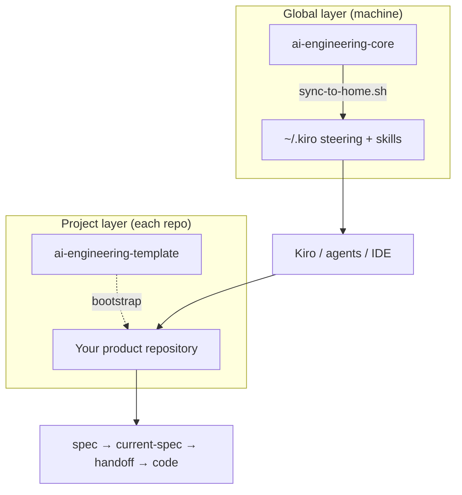
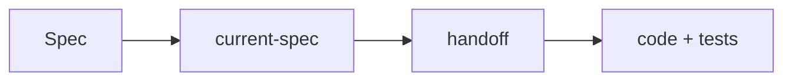

<p align="center">
  
</p>

---

## Try it in 2 minutes

```bash
mkdir try && cd try && git clone https://github.com/LaProgrammerie/ai-engineering-template.git .
mkdir -p .kiro/specs/hello
printf '%s\n' '- [ ] One shippable task' > .kiro/specs/hello/tasks.md
printf '%s\n' 'One verifiable goal.' > .kiro/specs/hello/requirements.md && printf '%s\n' 'Smallest viable approach.' > .kiro/specs/hello/design.md
# Kiro: open try → run skill create-handoff → writes docs/ai/active/handoff.md
# Cursor: open try → implement docs/ai/active/handoff.md only
```

---

# AI Engineering Framework

**Product entry point** — two-layer, spec-driven workflow with [Kiro](https://kiro.dev), Cursor, and compatible agents.

---

## Why it matters

**AI without structure does not scale** — across people, sessions, and tools.

This framework adds **structure before implementation**: **spec**, **projection** (`current-spec.md`), **execution contract** (`handoff.md`), then code.

---

## Who this is for

- **Developers** — serious daily use of AI in the IDE (agents, reviews, refactors); want a **repeatable habit**, not one-off prompts.
- **Teams** — scaling AI-assisted coding; need **shared discipline**, traceability, and the **same artefacts** in every repo.

---

## Role of this repository

This repository is **not** a third template.

It is an **umbrella**: system view, onboarding, and pointers to the two repositories that carry the actual artefacts.

---

| Repository | Role |
|------------|------|
| [**ai-engineering-core**](https://github.com/LaProgrammerie/ai-engineering-core) | **Global layer** — steering + reusable skills → synced to `~/.kiro/` |
| [**ai-engineering-template**](https://github.com/LaProgrammerie/ai-engineering-template) | **Project layer** — per-repo canon (`docs/ai/`), Kiro specs, handoff, IDE rules |

---

## What this is / is not

**This is:**

- a **workflow**
- a **discipline**
- a **system for AI-assisted engineering**

**This is not:**

- a **runtime framework**
- a **library**
- a **magic tool**

---

## Why this works

- **Prevents AI drift** — intent stays in spec and handoff; each session has a fixed contract.
- **Enforces scope discipline** — work outside `handoff.md` is out of scope until the handoff updates.
- **Aligns spec and code** — projection + handoff connect Kiro spec to what ships in the repo.
- **Reduces rework** — fewer wrong-feature loops when the contract is explicit.
- **Improves team collaboration** — same files, same order of operations, reviewable history.

---

## Demo

### What you see

Work moves **Kiro → `handoff.md` → Cursor**: spec in Kiro, execution scope frozen in **`handoff.md`**, then Cursor implements **only** what that contract allows.

Same repository the whole time; the GIF is a single pass through that chain.

Record your own version with **[`docs/demo-script.md`](docs/demo-script.md)**.

*Demo GIF coming soon.*

### The three beats

- **Spec creation** — `.kiro/specs/<feature>/` (requirements, design, tasks) in Kiro.
- **Handoff generation** — skill **`create-handoff`** → **`docs/ai/active/handoff.md`** (scope, files, DoD).
- **Implementation** — Cursor follows the handoff + project standards.

<p align="center">
  
</p>

---

## Try it now

```bash
mkdir demo && cd demo
git clone https://github.com/LaProgrammerie/ai-engineering-template.git .
```

### After clone

**Kiro** — open **`demo`**, add **`.kiro/specs/hello/`** (`requirements.md`, `design.md`, `tasks.md`), run **`create-handoff`**.

**Cursor** — open **`demo`**, implement from **`docs/ai/active/handoff.md`**.

**More:** [First feature in 5 minutes](#first-feature-in-5-minutes) · [`examples/simple-feature`](https://github.com/LaProgrammerie/ai-engineering-template/tree/main/examples/simple-feature).

---

## Overview

### Two layers

1. **Global layer** — how agents behave everywhere: language, scope, review/debug/refactor, **context-sync** when spec projections drift.
2. **Project layer** — what you build: product/architecture/standards canon, native Kiro specs, **cross-tool summary** (`current-spec.md`), **execution contract** (`handoff.md`).

### How tools use both

**`~/.kiro`** supplies portable habits; the **repo** supplies truth for *this* product.

> **In three lines:** Spec defines intent. Handoff defines execution. Code must follow the handoff.  
> (From [ai-engineering-core](https://github.com/LaProgrammerie/ai-engineering-core) — the mental model for the whole system.)

---

## Why this exists

### Common failure patterns

- context split across IDE, spec tool, and Git host;
- implementation that diverges from the agreed spec;
- vague or expanding scope mid-session.

### What this framework optimizes for

**Predictable**, **shareable**, **maintainable** collaboration with agents: explicit **intent** (spec), **visibility** (`current-spec.md`), **execution scope** (`handoff.md`), backed by **global** procedural skills (planning, review, debug, etc.).

### Adoption

**Progressive:** adopt pieces first; the design assumes you eventually use **both layers** together.

Deep rationale: [Why this template exists](https://github.com/LaProgrammerie/ai-engineering-template#why-this-template-exists).

---

## Architecture

### Layers

| Layer | Location | Owns |
|-------|----------|------|
| **Global** | [ai-engineering-core](https://github.com/LaProgrammerie/ai-engineering-core) → `~/.kiro/steering`, `~/.kiro/skills` | Cross-repo principles, output format, collaboration norms, reusable skills (`planning`, `code-review`, `debugging`, `refactor`, `release-checklist`, `context-sync`, …) |
| **Project** | [ai-engineering-template](https://github.com/LaProgrammerie/ai-engineering-template) (copied into each product repo) | `AGENTS.md`, `docs/ai/*`, `.kiro/specs/`, `.kiro/steering/` (project-specific), `.kiro/skills/` (e.g. `create-handoff`), `.cursor/`, Copilot instructions |

**Precedence:** project **`AGENTS.md`** and project **`.kiro/`** **override** global steering when they conflict — [ai-engineering-core `00-index.md`](https://github.com/LaProgrammerie/ai-engineering-core/blob/main/steering/00-index.md).

---

### System diagram



---

Tighter **clone → sync → repo** view: [ai-engineering-core README](https://github.com/LaProgrammerie/ai-engineering-core#how-the-two-halves-connect).

---

### Runtime workflow (conceptual)

**Specify → summarize → contract**

1. **Specify** in Kiro under `.kiro/specs/<feature>/` (requirements, design, tasks).
2. **Project** maintains `docs/ai/active/current-spec.md` when the spec changes materially (cross-tool summary).
3. **Contract** for the session: `docs/ai/active/handoff.md` (scope, allowed files, plan, DoD) — often via **`create-handoff`**.

---

**Implement → support**

4. **Implement** in Cursor (or similar) from handoff + `docs/ai/03-standards.md` (+ architecture as needed).
5. **Global skills** — planning, review, debug, refactor, release, **context-sync** to realign spec, projections, and code.

Step-by-step: [How the system works](https://github.com/LaProgrammerie/ai-engineering-template#2-how-the-system-works) in the template README.

---

## Repositories (where to go next)

| Need | Go to |
|------|--------|
| Install global steering/skills, skill reference, `sync-to-home.sh` | [**ai-engineering-core**](https://github.com/LaProgrammerie/ai-engineering-core) |
| Bootstrap a new product repo, `AGENTS.md`, `docs/ai`, hooks, “what to update when” | [**ai-engineering-template**](https://github.com/LaProgrammerie/ai-engineering-template) |
| Map of every file’s role and anti-drift rules | [context-map.md](https://github.com/LaProgrammerie/ai-engineering-template/blob/main/docs/ai/context-map.md) (in the template) |

---

## Spec, `current-spec`, handoff, and code

### Roles

| Artefact | Role |
|----------|------|
| **`.kiro/specs/<feature>/`** | **Native spec** — authoritative requirements / design / tasks in Kiro. |
| **`docs/ai/active/current-spec.md`** | **Projection** — short, tool-agnostic summary so IDE and other agents see the same “active story” without opening every spec file. |
| **`docs/ai/active/handoff.md`** | **Execution contract** — what to build *now*, in which files, with what done means. |
| **Code + tests** | Must align with **handoff**; if spec moved, refresh handoff and/or run **context-sync** (global skill in core). |

---

Canonical detail: [Key file roles](https://github.com/LaProgrammerie/ai-engineering-template#2-how-the-system-works) in the template.

### The chain at a glance

```
.kiro/specs/<feature>/  →  docs/ai/active/current-spec.md  →  docs/ai/active/handoff.md  →  code (+ tests)
```



---

## End-to-end workflow (summary)

### From spec to code

1. **Plan** (global **`planning`** skill) to structure work before or alongside spec authoring.
2. **Author / update** Kiro spec in the **project** repo.
3. **Sync** `current-spec.md` when the narrative for other tools should change.
4. **Write / refresh** `handoff.md` (project **`create-handoff`** skill).

---

### Ship and maintain

5. **Implement** from handoff.
6. **Review** with global **`code-review`**; **debug** with **`debugging`**; before release **`release-checklist`**.
7. If things feel out of sync, run **`context-sync`** (global).

Narrative example (login feature, cross-repo): [flow-login.md](https://github.com/LaProgrammerie/ai-engineering-core/blob/main/examples/flow-login.md).

---

## Quickstart

*Fastest path:* **[Try it now](#try-it-now)** (minimal clone + Kiro + Cursor).

### A. Ultra quick (copy / paste)

**Once per machine — global layer into `~/.kiro`:**

```bash
git clone https://github.com/LaProgrammerie/ai-engineering-core.git
cd ai-engineering-core
chmod +x sync-to-home.sh && ./sync-to-home.sh
# Restart or reload Kiro
```

**New project from the template:**

```bash
mkdir my-project && cd my-project
git clone https://github.com/LaProgrammerie/ai-engineering-template.git .
```

**Then in Kiro and Cursor:**

```text
Kiro: open folder → my-project
Kiro: create .kiro/specs/first-feature/ (requirements.md, design.md, tasks.md)
Kiro: run skill create-handoff → docs/ai/active/handoff.md
Cursor: open my-project → implement only what handoff.md allows
```

SSH URLs: `git@github.com:LaProgrammerie/ai-engineering-core.git` and `git@github.com:LaProgrammerie/ai-engineering-template.git`.

---

### B. Guided (what each step does)

| Step | What happens |
|------|----------------|
| Clone **ai-engineering-core** + **`./sync-to-home.sh`** | Copies steering + skills into **`~/.kiro/`** so every repo gets the same agent habits. |
| **`mkdir` / clone template into `my-project`** | You get `AGENTS.md`, `docs/ai/`, `.kiro/specs/`, `.cursor/`, and the **`create-handoff`** skill. |
| Create **`.kiro/specs/<feature>/`** in Kiro | Native spec: intent split into requirements → design → tasks. |
| Run **`create-handoff`** | Fills **`docs/ai/active/handoff.md`** — the execution contract for this session. |
| Implement in **Cursor** | IDE follows **handoff** + **`docs/ai/03-standards.md`**; keeps scope bounded. |

When the spec story should be visible outside Kiro, edit **`docs/ai/active/current-spec.md`**. If spec and code diverge, use global **`context-sync`** in Kiro.

---

### C. Conceptual (how it fits together)

The minimum path through the system is: **sync core → bootstrap from template → spec → (optional) current-spec → handoff → code.**  
Progressive adoption is OK; full value shows when both layers and the spec chain are in use.

- **Bootstrap checklist (real product):** [After cloning this template](https://github.com/LaProgrammerie/ai-engineering-template#after-cloning-this-template-do-this-first) — fill `AGENTS.md`, `docs/ai/01–03`, invariants.  
- **Install detail:** [ai-engineering-core — Install](https://github.com/LaProgrammerie/ai-engineering-core#install-2-minutes).  
- **Feature order:** [What to update when](https://github.com/LaProgrammerie/ai-engineering-template#4-what-to-update-when).

---

## First feature in 5 minutes

_No theory — do this in order._

1. **`./sync-to-home.sh`** from a clone of [ai-engineering-core](https://github.com/LaProgrammerie/ai-engineering-core) if you have not already; reload Kiro.
2. **`git clone https://github.com/LaProgrammerie/ai-engineering-template.git try-framework && cd try-framework`**
3. Open **`try-framework`** in **Kiro**. Add **`.kiro/specs/hello/`** with three small files: **`requirements.md`** (one sentence goal), **`design.md`** (one paragraph), **`tasks.md`** (2 bullet tasks).
4. Optionally one-line update **`docs/ai/active/current-spec.md`** so it names `hello` and the goal.
5. Run **`create-handoff`** in Kiro → confirm **`docs/ai/active/handoff.md`** is filled.
6. Open the same folder in **Cursor**; prompt: *Implement `docs/ai/active/handoff.md` only; follow `docs/ai/03-standards.md`.*
7. Run whatever test command your stack uses (see `03-standards.md` or template defaults), e.g. **`npm test`** / **`pytest`** / **`go test ./...`**.

Worked files to compare: [examples/simple-feature](https://github.com/LaProgrammerie/ai-engineering-template/tree/main/examples/simple-feature).

---

## When to update which layer

**Rule of thumb**

- Change **global** when a habit or workflow should apply to **all** your repos (e.g. how you want reviews formatted, or a new global skill).
- Change **project** when something is **specific to this product** (stack, boundaries, active feature spec, handoff for today’s session).

The template maintains the authoritative **“if you change X, update Y”** table: [What to update when](https://github.com/LaProgrammerie/ai-engineering-template#4-what-to-update-when).

### Cheat sheet (which file to touch)

| You changed… | Update |
|--------------|--------|
| **Product** / durable scope | `docs/ai/01-product.md` |
| **Architecture** / boundaries | `docs/ai/02-architecture.md` (+ `docs/ai/05-decisions.md` if it is a durable ADR) |
| **Feature** (requirements / design / tasks) | `.kiro/specs/<feature>/` **then** `docs/ai/active/current-spec.md` **and** `handoff.md` if execution scope changed |
| **Only the next task** (same spec, new session) | `docs/ai/active/handoff.md` |

---

## Anti-drift guarantees (what the framework enforces)

Not magic — **conventions + explicit files**:

- **Single source of truth per concern** in `docs/ai/` (product, architecture, standards, workflows, decisions).
- **Spec → projection → handoff** chain so intent is not only inside Kiro.
- **Global skills** (`context-sync`, `debugging`, `code-review`) that are trained to flag **spec vs code** and **stale handoff**.
- **Repo wins over global** where they conflict, so the product layer stays sovereign.

Full map and rules: [context-map.md](https://github.com/LaProgrammerie/ai-engineering-template/blob/main/docs/ai/context-map.md).

---

## Limits and expectations

- **Not magic.** Files do not stay aligned by themselves unless you maintain them or add hooks. The framework is **conventions + explicit artefacts**, not auto-healing infrastructure.
- **Requires discipline.** Ignoring `handoff.md`, never updating `current-spec.md`, or skipping the spec chain → agents **will** drift. **Discipline is the product** (see [ai-engineering-core — Why use it](https://github.com/LaProgrammerie/ai-engineering-core#why-use-it)).
- **Not for every task.** For a one-off throwaway script, this stack is **overkill**; it pays off on **shared, evolving** codebases and teams that care about traceability from intent to code.
- **Progressive adoption is fine**; full value shows up when **core + template + spec → handoff → code** are used together.

---

## Failure modes

**This framework will fail if:**

- **The spec is not maintained** — code and decisions move on; `.kiro/specs/` still describes old intent. Humans and agents reason from different sources.
- **The handoff is outdated** — spec or `current-spec.md` changed; `handoff.md` still lists wrong files, tasks, or DoD. You optimize the wrong job.
- **Scope is ignored** — prompts expand past `handoff.md` (“while we’re here”). You lose traceability and clean review.
- **Spec and implementation are conflated** — requirements smuggle in code-level detail, or specs read like already-built systems. Review and rollback get expensive.
- **People over-trust the model** — nobody reads the handoff or the diff; merges are assumed safe. **Skills are not proof.**

### How to avoid

- **Sync spec → handoff** — After any material spec change, refresh **`create-handoff`** / **`handoff.md`** before the next coding session.
- **Treat `handoff.md` as the contract** — Not in the handoff → not in scope for this pass (or update the handoff first).
- **Update docs when scope changes** — Cascade **`current-spec.md`** and canon **`docs/ai/*`** per the [cheat sheet](#cheat-sheet-which-file-to-touch) and template [What to update when](https://github.com/LaProgrammerie/ai-engineering-template#4-what-to-update-when).

---

## Examples and diagrams

| Example | Where |
|---------|--------|
| End-to-end spec → handoff → code (concrete files) | [ai-engineering-template: `examples/simple-feature/`](https://github.com/LaProgrammerie/ai-engineering-template/tree/main/examples/simple-feature) |
| Global + project story (login) | [ai-engineering-core: `examples/flow-login.md`](https://github.com/LaProgrammerie/ai-engineering-core/blob/main/examples/flow-login.md) |
| ASCII flow (spec pipeline) | [template README diagram](https://github.com/LaProgrammerie/ai-engineering-template#diagram-end-to-end-flow) |

Local index for this umbrella repo: [`examples/README.md`](examples/README.md).

---

## Scope of this umbrella repository

**In scope here:** orientation, links, high-level architecture, quickstart pointers.

**Out of scope:** duplicating full steering text, skill bodies, or the template’s `docs/ai` canon — those stay in **core** and **template** respectively.

**Future (optional):** roadmap, ADRs that span both repos, or shared diagrams — can live under `docs/` as the framework evolves.

**Distribution:** commit **`docs/demo.gif`** after recording (see **[Demo](#demo)** and [`docs/demo-script.md`](docs/demo-script.md)).

---

## Future DX improvements

**Not implemented today** — the following are **directional ideas** only; there is no supported CLI, generator package, or bundled automation in these repositories yet.

| Direction | Idea |
|-----------|------|
| **CLI** | One tool to scaffold spec folders, validate structure, or drive **`handoff.md`** from `.kiro/specs/` (today: Kiro + **`create-handoff`** skill). |
| **Template generator** | Interactive or flags-based bootstrap beyond “clone template” (stack, test runner, CI stub). |
| **Automation hooks** | Stronger default wiring between spec changes and **`current-spec.md`** / **`handoff.md`** (the template already documents [optional hooks](https://github.com/LaProgrammerie/ai-engineering-template#5-hooks-and-automation); nothing is mandatory). |

Contributions would likely land in **ai-engineering-template** or **ai-engineering-core** once scoped; this umbrella repo stays documentation-first unless the project decides otherwise.

---

## License

This umbrella repo is released under the [MIT License](LICENSE) (same spirit as the sibling repositories).

---

## GitHub repository metadata (suggested)

- **Description:** `Umbrella: AI engineering framework — global Kiro layer (ai-engineering-core) + project template (ai-engineering-template). Spec → handoff → code.`
- **Topics:** `ai`, `kiro`, `cursor`, `context-engineering`, `spec-driven-development`, `developer-tools`, `workflow`, `documentation`, `agents`
